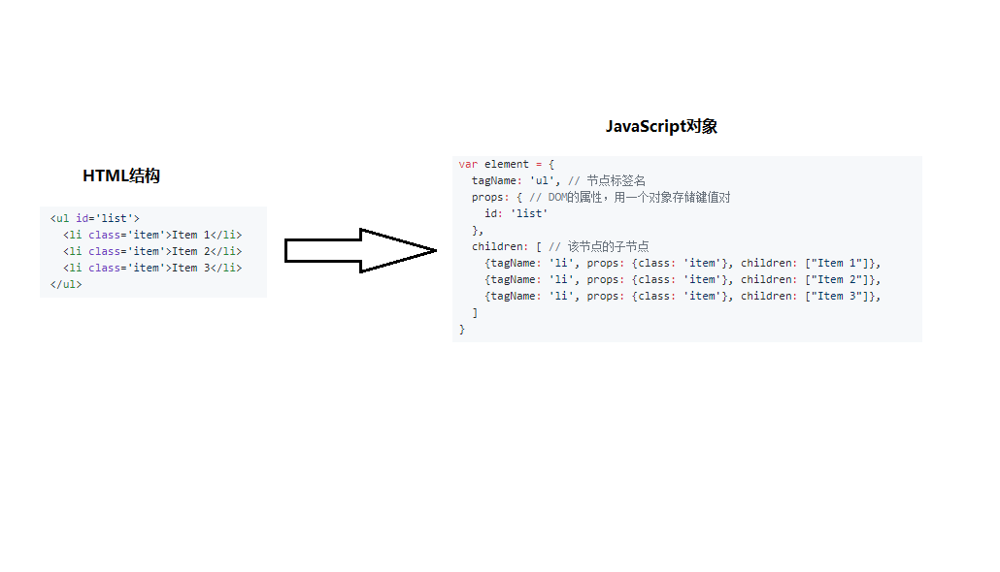
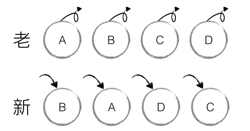
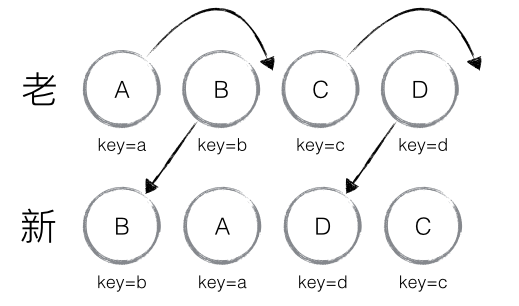
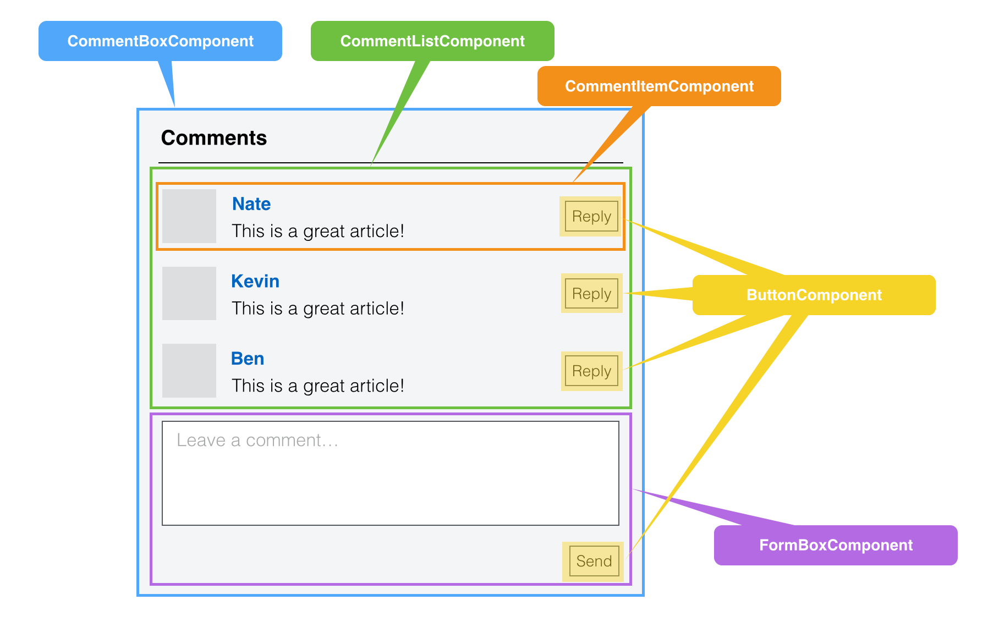

# react


## React 背景介绍

- [React 入门实例教程](http://www.ruanyifeng.com/blog/2015/03/react.html)

React 起源于 Facebook 的内部项目，因为该公司对市场上所有 JavaScript MVC 框架，都不满意，就决定自己写一套，用来架设 [Instagram 照片墙](https://www.instagram.com/) 的网站。做出来以后，发现这套东西很好用，就在 2013 年 5 月开源了。

## 什么是 React

- A JAVASCRIPT LIBRARY FOR BUILDING USER INTERFACES
  - 用来构建 UI 的 JavaScript 库
- [React 官网](https://reactjs.org/)
- [React 中文文档](https://react.docschina.org/)
- [React 中文文档（备选）](https://www.reactjscn.com/)

### 特点

- 1 通过 JSX 语法实现组件化开发，**为函数式的 UI 编程方式打开了大门**
- 2 性能高的让人称赞：通过 `diff算法` 和 `虚拟DOM` 实现视图的高效更新
- 3 HTML 仅仅是个开始

```html
> JSX --TO--> EveryThing

- JSX --> HTML
- JSX --> native ios或android中的组件（XML）
- JSX --> VR
- JSX --> 物联网
```

## 为什么要用 React

- 1 使用`组件化`开发方式，符合现代 Web 开发的趋势
- 2 技术成熟，社区完善，配件齐全，适用于大型 Web 项目（生态系统健全）
- 3 由 Facebook 专门的团队维护，技术支持可靠
- 4 ReactNative - Learn once, write anywhere: Build mobile apps with React
- 5 使用方式简单，性能非常高，支持服务端渲染
- 6 React 非常火，从技术角度，可以满足好奇心，提高技术水平；从职业角度，有利于求职和晋升，有利于参与潜力大的项目

## React 中的核心概念

- 1 虚拟 DOM（Virtual DOM）
- 2 Diff 算法（虚拟 DOM 的加速器，提升 React 性能的法宝）

## 虚拟 DOM（Vitural DOM）

> React 将 DOM 抽象为虚拟 DOM，虚拟 DOM 其实就是用一个对象来描述 DOM，通过对比前后两个对象的差异，最终只把变化的部分重新渲染，提高渲染的效率

- 

- [如何实现一个 Virtual DOM 算法](https://github.com/livoras/blog/issues/13)
- [理解 Virtual DOM](https://www.zhihu.com/question/31809713)

### VituralDOM 的处理方式

- 1 用 JavaScript 对象结构表示 DOM 树的结构，然后用这个树构建一个真正的 DOM 树，插到文档当中
- 2 当状态变更的时候，重新构造一棵新的对象树。然后用新的树和旧的树进行比较，记录两棵树差异
- 3 把 2 所记录的差异应用到步骤 1 所构建的真正的 DOM 树上，视图就更新了

## Diff 算法

- [Reconciliation diff](https://reactjs.org/docs/reconciliation.html)
- [diff 算法 - 中文文档](https://react.docschina.org/docs/reconciliation.html)
- [不可思议的 react diff](https://zhuanlan.zhihu.com/p/20346379)
- [React diff 算法](https://github.com/zmmbreeze/blog/issues/9)

> 当你使用 React 的时候，在某个时间点 render() 函数创建了一棵 React 元素树，
> 在下一个 state 或者 props 更新的时候，render() 函数将创建一棵新的 React 元素树，
> React 将对比这两棵树的不同之处，计算出如何高效的更新 UI（只更新变化的地方）

```html
了解：

有一些解决将一棵树转换为另一棵树的最小操作数算法问题的通用方案。然而，树中元素个数为n，最先进的算法 的时间复杂度为 O(n3) 。
如果直接使用这个算法，在React中展示1000个元素则需要进行10亿次的比较。这操作太过昂贵，相反，React基于两点假设，实现了一个O(n)算法，提升性能：
```

- React 中有两种假定：
  - 1 **两个不同类型的元素会产生不同的树**
  - 2 **开发者可以通过 key 属性指定不同树中没有发生改变的子元素**

### Diff 算法的说明 - 1

- 如果两棵树的根元素类型不同，React 会销毁旧树，创建新树

```js
// 旧树
<div>
  <Counter />
</div>

// 新树
<span>
  <Counter />
</span>

执行过程：destory Counter -> insert Counter
```

### Diff 算法的说明 - 2

- 对于类型相同的 React DOM 元素，React 会对比两者的属性是否相同，只更新不同的属性
- 当处理完这个 DOM 节点，React 就会递归处理子节点。

```html
// 旧
<div className="before" title="stuff"></div>
// 新
<div className="after" title="stuff"></div>
只更新：className 属性

// 旧
<div style={{color: 'red', fontWeight: 'bold'}}></div>
// 新
<div style={{color: 'green', fontWeight: 'bold'}}></div>
只更新：color属性
```

### Diff 算法的说明 - 3

- 1 当在子节点的后面添加一个节点，这时候两棵树的转化工作执行的很好

```js
// 旧
<ul>
  <li>first</li>
  <li>second</li>
</ul>

// 新
<ul>
  <li>first</li>
  <li>second</li>
  <li>third</li>
</ul>

执行过程：
React会匹配新旧两个<li>first</li>，匹配两个<li>second</li>，然后添加 <li>third</li> tree
```

- 2 但是如果你在开始位置插入一个元素，那么问题就来了：

```js
// 旧
<ul>
  <li>1</li>
  <li>2</li>
</ul>

// 新
<ul>
  <li>3</li>
  <li>1</li>
  <li>2</li>
</ul>

执行过程：
React将改变每一个子节点，而非保持 <li>Duke</li> 和 <li>Villanova</li> 不变
```

### key 属性

> 为了解决以上问题，React 提供了一个 key 属性。当子节点带有 key 属性，React 会通过 key 来匹配原始树和后来的树。

```js
// 旧
<ul>
  <li key="2015">1</li>
  <li key="2016">2</li>
</ul>

// 新
<ul>
  <li key="2014">3</li>
  <li key="2015">1</li>
  <li key="2016">2</li>
</ul>

执行过程：
现在 React 知道带有key '2014' 的元素是新的，对于 '2015' 和 '2016' 仅仅移动位置即可
```

- 说明：key 属性在 React 内部使用，但不会传递给你的组件
- 推荐：在遍历数据时，推荐在组件中使用 key 属性：`<li key={item.id}>{item.name}</li>`
- 注意：**key 只需要保持与他的兄弟节点唯一即可，不需要全局唯一**
- 注意：**尽可能的减少数组 index 作为 key，数组中插入元素的等操作时，会使得效率底下**

### key demo

- 
- 执行过程：B != A，则创建并插入 B，删除 A；以此类推，创建并插入 A、D、C，删除 B、C、D

- 
- 执行过程：B、D 不做任何操作，A、C 进行移动操作

---

## React 的基本使用

- 安装：`npm i -S react react-dom`
- `react`：react 是 React 库的入口点
- `react-dom`：提供了针对 DOM 的方法，比如：把创建的虚拟 DOM，渲染到页面上

```js
// 1. 导入 react
import React from 'react'
import ReactDOM from 'react-dom'

// 2. 创建 虚拟DOM
const divVD = React.createElement(
  'div',
  {
    title: 'hello react'
  },
  'Hello React！！！'
)

// 3. 渲染
ReactDOM.render(divVD, document.getElementById('app'))
```

### API 说明

- createElement()：知道即可
- render()

```js
// https://reactjs.org/docs/react-api.html
// 作用：根据指定的参数，创建react对象
//
// 第一个参数：指定创建虚拟DOM的类型
//  类型：string 或者 react组件
//  1 任意字符串类型的标签名称，比如：'div' / 'span'
//  2 react组件类型，比如：<Welcome></Welcome>
// 第二个参数：指定元素自身的属性
//  类型：对象或者null
// 第三个参数：当前元素的子元素
//  类型：string 或者 createElement() 的返回值
// 返回值：react对象
React.createElement(type, [props], [...children])

// https://reactjs.org/docs/react-dom.html
// 作用：渲染react元素
// 第一个参数：指定要渲染的react对象
// 第二个参数：指定渲染到页面中的容器（DOM对象）
// 第三个参数：回调函数
ReactDOM.render(element, container)
```

### createElement()的问题

- 说明：`createElement()`方式，代码编写不友好，太复杂

```js
var dv = React.createElement(
  'div',
  { className: 'shopping-list' },
  React.createElement('h1', null, 'Shopping List for '),
  React.createElement(
    'ul',
    null,
    React.createElement('li', null, 'Instagram'),
    React.createElement('li', null, 'WhatsApp')
  )
)
// 渲染
ReactDOM.render(dv, document.getElementById('app'))
```

### JSX 的基本使用

- 注意：JSX 语法，最终会被编译为 createElement() 方法
- 推荐：**使用 JSX 的方式创建组件**

- JSX - JavaScript XML
- 安装：`npm i -D babel-preset-react` （依赖与：babel-core/babel-loader）
  > 注意：JSX 的语法需要通过 babel-preset-react 编译后，才能被解析执行

```js
/* 1 在 .babelrc 开启babel对 JSX 的转换 */
{
  "presets": [
    "env", "react"
  ]
}

/* 2 webpack.config.js */
module: [
  rules: [
    { test: /\.js$/, use: 'babel-loader', exclude: /node_modules/ },
  ]
]

/* 3 在 js 文件中 使用 JSX */
const dv = (
  <div title="标题" className="cls container">Hello JSX!</div>
)

/* 4 渲染 JSX 到页面中 */
ReactDOM.render(dv, document.getElementById('app'))
```

## JSX 的注意点

- 注意 1: 如果在 JSX 中给元素添加类, 需要使用 `className` 代替 class
  - 类似：label 的 for 属性，使用`htmlFor`代替
- 注意 2：在 JSX 中可以直接使用 JS 代码，直接在 JSX 中通过 {} 中间写 JS 代码即可
- 注意 3：在 JSX 中**只能使用表达式**，但是不能出现 语句！！！
- 注意 4：在 JSX 中注释语法：`{/* 中间是注释的内容 */}`

## React 组件

> React 组件可以让你把 UI 分割为独立、可复用的片段，并将每一片段视为相互独立的部分。

- 组件是由一个个的 HTML 元素组成的
- 概念上来讲, 组件就像 JS 中的函数。它们接受用户输入（`props`），并且**返回**一个 React 对象，用来描述展示在页面中的内容
-  

### React 创建组件的两种方式

- 1 通过 JS 函数 创建（无状态组件）
- 2 通过 class 创建（有状态组件）

```html
函数式组件 和 class 组件的使用场景说明：
1 如果一个组件仅仅是为了展示数据，那么此时就可以使用 函数组件
2 如果一个组件中有一定业务逻辑，需要操作数据，那么就需要使用 class 创建组件，因此，此时需要使用 state
```

#### JavaScript 函数创建

- 注意：1 函数名称必须为大写字母开头，React 通过这个特点来判断是不是一个组件
- 注意：2 函数必须有返回值，返回值可以是：JSX 对象或`null`
- 注意：3 返回的 JSX，必须有*一个*根元素
- 注意：4 组件的返回值使用`()`包裹，避免换行问题

```js
function Welcome(props) {
  return (
    <div className="shopping-list">
      {/* 注释的写法 */}
      <h1>Shopping List for {props.name}</h1>
      <ul>
        <li>Instagram</li>
        <li>WhatsApp</li>
      </ul>
    </div>
  )
}

ReactDOM.render(<Welcome name="jack" />, document.getElementById('app'))
```

#### class 创建

- 注意：基于 `ES6` 中的 class，需要配合 `babel` 将代码转化为浏览器识别的 ES5 语法
- 安装：`npm i -D babel-preset-env`

```js
class ShoppingList extends React.Component {
  constructor(props) {
    super(props)
  }

  render() {
    return (
      <div className="shopping-list">
        <h1>Shopping List for {this.props.name}</h1>
        <ul>
          <li>Instagram</li>
          <li>WhatsApp</li>
        </ul>
      </div>
    )
  }
}
```

## 给组件传递数据 - 父子组件传递数据

- 组件中有一个 `只读的对象` 叫做 `props`，无法给 props 添加属性
- 获取方式：函数参数 `props`
- 作用：将传递给组件的属性转化为 `props` 对象中的属性

```js
function Welcome(props){
  // props ---> { username: 'zs', age: 20 }
  return (
    <div>
      <div>Welcome React</div>
      <h3>姓名：{props.username}----年龄是：{props.age}</h3>
    </div>
  )
}

// 给 Hello组件 传递 props：username 和 age
ReactDOM.reander(<Hello username="zs" age={20}></Hello>, ......)
```

## 封装组件到独立的文件中

```js
// ./components/Hello2.js

// 1. 引入React模块
// 由于 JSX 编译后会调用 React.createElement 方法，所以在你的 JSX 代码中必须首先声明 React 变量。
import React from 'react'

// 2. 使用function构造函数创建组件
function Hello2(props) {
  return (
    <div>
      <div>这是Hello2组件</div>
      <h1>这是大大的H1标签，我大，我骄傲！！！</h1>
      <h6>这是小小的h6标签，我小，我傲娇！！！</h6>
    </div>
  )
}

// 3. 导出组件
export default Hello2

// app.js
// 使用组件：
import Hello2 from './components/Hello2'
```

## props 和 state

### props

- 作用：**给组件传递数据，一般用在父子组件之间**
- 说明：React 把传递给组件的属性转化为一个对象并交给 `props`
- 特点：`props`是只读的，无法给`props`添加或修改属性
- `props.children`：获取组件的内容，比如：
  - `<Hello>组件内容</Hello>` 中的 `组件内容`

```js
// props 是一个包含数据的对象参数，不要试图修改 props 参数
// 返回值：react元素
function Welcome(props) {
  // 返回的 react元素中必须只有一个根元素
  return <div>hello, {props.name}</div>
}

class Welcome extends React.Component {
  constructor(props) {
    super(props)
  }

  render() {
    return <h1>Hello, {this.props.name}</h1>
  }
}
```

### state

- 作用：用来给组件提供`组件内部`使用的数据
- 注意：只有通过`class`创建的组件才具有状态
- 注意：**状态是私有的，完全由组件来控制**
- 注意：不要在 `state` 中添加 `render()` 方法中不需要的数据，会影响渲染性能！
  - 可以将组件内部使用但是不渲染在视图中的内容，直接添加给 this
- 注意：不要在 `render()` 方法中调用 setState() 方法来修改`state`的值
  - 但是可以通过 `this.state.name = 'rose'` 方式设置 state（不推荐!!!!）

```js
class Hello extends React.Component {
  constructor() {
    this.state = {
      gender: 'male'
    }
  }

  render() {
    return (
      <div>
        性别：
        {this.state.gender}
      </div>
    )
  }
}
```

## JSX 语法转化过程

```js
// JSX
const element = (
  <h1 className="greeting">
    Hello, world!
  </h1>
)

// JSX -> createElement
const element = React.createElement(
  'h1',
  {className: 'greeting'},
  'Hello, world!'
)

// React elements: 使用对象的形式描述页面结构
// Note: 这是简化后的对象结构
const element = {
  tagName: 'h1',
  props: {
    className: 'greeting',
  },
  children: ['Hello, world']
}

// HTML
<h1 class="greeting">
  Hello, world!
</h1>
```

## 评论列表案例

- 巩固有状态组件和无状态组件的使用
- 两个组件：`<CommentList></CommentList>` 和 `<Comment></Comment>`

```js
[
  { user: '张三', content: '哈哈，沙发' },
  { user: '张三2', content: '哈哈，板凳' },
  { user: '张三3', content: '哈哈，凉席' },
  { user: '张三4', content: '哈哈，砖头' },
  { user: '张三5', content: '哈哈，楼下山炮' }
]

// 属性扩散
<Comment {...item} key={i}></Comment>
```

## style 样式

```js
// 1. 直接写行内样式：
<li style={{border:'1px solid red', fontSize:'12px'}}></li>

// 2. 抽离为对象形式
var styleH3 = {color:'blue'}
var styleObj = {
  liStyle:{border:'1px solid red', fontSize:'12px'},
  h3Style:{color:'green'}
}

<li style={styleObj.liStyle}>
  <h3 style={styleObj.h3Style}>评论内容：{props.content}</h3>
</li>

// 3. 使用样式表定义样式：
import '../css/comment.css'
<p className="pUser">评论人：{props.user}</p>
```

## 相关文章

- [React 数据流和组件间的沟通总结](http://www.cnblogs.com/tim100/p/6050514.html)
- [单向数据流和双向绑定各有什么优缺点？](https://segmentfault.com/q/1010000005876655/a-1020000005876751)
- [怎么更好的理解虚拟 DOM?](https://www.zhihu.com/question/29504639?sort=created)
- [React 中文文档](https://discountry.github.io/react/)
- [React 源码剖析系列 － 不可思议的 react diff](http://blog.csdn.net/yczz/article/details/49886061)
- [深入浅出 React（四）：虚拟 DOM Diff 算法解析](http://www.infoq.com/cn/articles/react-dom-diff?from=timeline&isappinstalled=0)

## ES6 中 class 关键字的使用

- **ES6 中的所有的代码都是运行在严格模式中的**
- 1 它是用来定义类的，是 ES6 中实现面向对象编程的新方式
- 2 使用`static`关键字定义静态属性
- 3 使用`constructor`构造函数，创建实例属性
- [class 关键字](http://es6.ruanyifeng.com/#docs/class)

```js
class Person {
  constructor(age) {
    // 实例属性
    this.age = age
  }
}

// 静态属性
Person.staticName = '静态属性'

const p = new Person(19)
```

- 在 class 中定义方法

```js
// 实例方法
sayHello () {
  console.log('大家好，我今年' + this.age + '了');
}

// 静态方法
static wangwang () {
  console.log('我是小明，我新get了一个技能，会暖床');
}
```

- 实现继承的方式

```js
class American extends Person {
  constructor() {
    // 必须调用super(), super表示父类的构造函数
    super()

    this.skin = 'white'
    this.eyeColor = 'white'
  }
}
```
